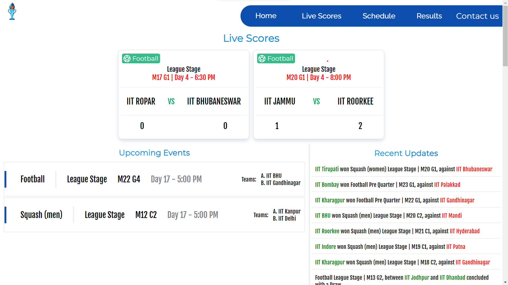
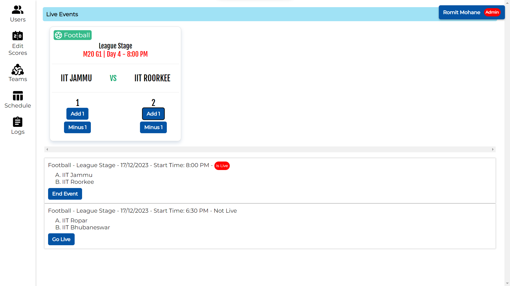
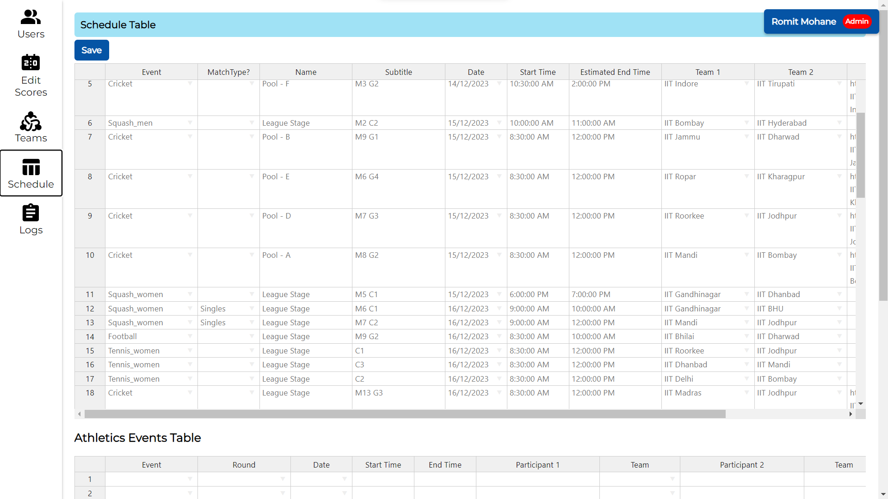

This project was bootstrapped with [Create React App](https://github.com/facebook/create-react-app) and pushed to [_InterIIT-Sports Organization_](https://github.com/InterIIT-Sports)

## Features

- Home Page allowing viewers to see the Live Events Scores, Upcoming Events List, and also the Recent Updates about the games which have ended.
- Admin Pages (protected) that allows admins to add volunteers, teams and events through the Schedule Table. The Live Scores can be sent to the server from here. Also has a Logs page.
- A User Manual for guiding the user with the various features of the admin panel can be found [here](https://docs.google.com/document/d/1KpjU-qifs7S4cfy7ImXSCwoF4ycOys0Esmv7cccqAgA)

## Remarks for further development and use for different Events

No Event (InterIIT 2023) Specific data has been used or taken for consideration in the writing of the application except the `StartingDate` variable in the `App.tsx` file (`src` folder) which has been set to 14 to represent the starting date of the InterIIT 2023 Sports meet at IIT Gandhinagar. This can change be changed to whenever a particular event is starting.

## Available Scripts

In the project directory, you can run:

### `npm start`

Runs the app in the development mode.\
Open [http://localhost:3000](http://localhost:3000) to view it in the browser.

The page will reload if you make edits.\
You will also see any lint errors in the console.

### `npm test`

Launches the test runner in the interactive watch mode.\
See the section about [running tests](https://facebook.github.io/create-react-app/docs/running-tests) for more information.

### `npm run build`

Builds the app for production to the `build` folder.\
It correctly bundles React in production mode and optimizes the build for the best performance.

The build is minified and the filenames include the hashes.\
Your app is ready to be deployed!

See the section about [deployment](https://facebook.github.io/create-react-app/docs/deployment) for more information.

### `npm run eject`

**Note: this is a one-way operation. Once you `eject`, you can’t go back!**

If you aren’t satisfied with the build tool and configuration choices, you can `eject` at any time. This command will remove the single build dependency from your project.

Instead, it will copy all the configuration files and the transitive dependencies (webpack, Babel, ESLint, etc) right into your project so you have full control over them. All of the commands except `eject` will still work, but they will point to the copied scripts so you can tweak them. At this point you’re on your own.

You don’t have to ever use `eject`. The curated feature set is suitable for small and middle deployments, and you shouldn’t feel obligated to use this feature. However we understand that this tool wouldn’t be useful if you couldn’t customize it when you are ready for it.

## Original Authors

- [Romit Mohane](https://github.com/Reckadon) - Front-End
- [Karan Gandhi](https://github.com/Karan-Gandhi) - Back-End
